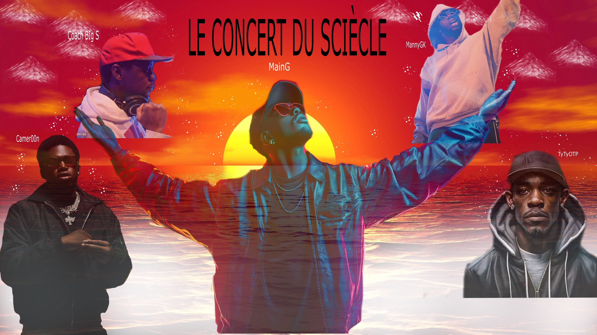

# TP1

## description
C'est une affiche de concert sur 5 rappeur et compositeur dont j'ai trouver. Pour le réaliser, j'ai commencer par chercher un fond d'écran dont je savais qui allait être "marquant" au yeux des gens, alors j'ai choisi un coucher de soleil. Dans le coucher de soleil j'ai rajouter 5 photos liscenser de rappeur dont je les est coller sur le coucher de soleil. Pour chacune de ses photos, j'ai changer la taille, l'opacité des images et un peu de leur couler pour qu'il y aille un vrai mélange entre les images. Après tout les ajustements, j'ai rajouter un blanc pour cacher un peu l'eau en bas de l'image maiss pas complètement pour rajouter un peu de style ainsi que des motifs partout sur l'image. Par exemple, j'ai rajouter des nuages en forme de montagne dans les coins en haut à droite et à gauche, j'ai mis chacun de leur nom à une place ou je trouvais serai la meilleur pour eux et finalement j'ai mis des petits point comme si c'étais des étoiles à l'entour de chaque personne pour rajouter du style à ceux-ci.
## sources
https://wallpaperaccess.com/4k-ultra-hd-sunset ( coucher de soleil)
https://unsplash.com/fr/photos/homme-levant-la-main-gauche-avec-un-microphone-bl1_IhZL6Pc (l'homme en haut à droite)
https://www.istockphoto.com/id/foto/rapper-di-studio-rekaman-gm1129084766-298133338 (l'homme en haut à gauche)
https://www.pexels.com/fr-fr/photo/rappeur-style-en-lunettes-de-soleil-avec-microphone-33676168/ (l'homme en bas à gauche)
https://static.vecteezy.com/system/resources/previews/056/103/378/non_2x/a-man-in-a-leather-jacket-and-sunglasses-is-standing-in-front-of-neon-lights-free-photo.jpg (l'homme au milieu)
https://fr.vecteezy.com/photo/23115086-noir-rappeur-musicien-portrait-de-une-jeune-noir-masculin-afro-americain-contre-une-fonce-contexte-generatif-ai (L'homme en bas à droite)
